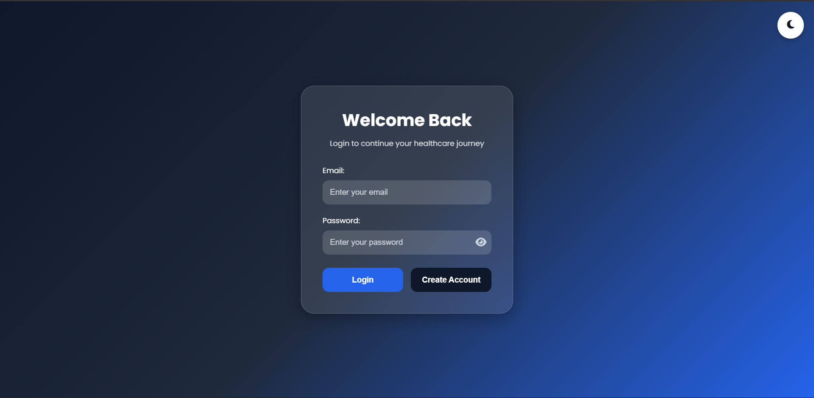
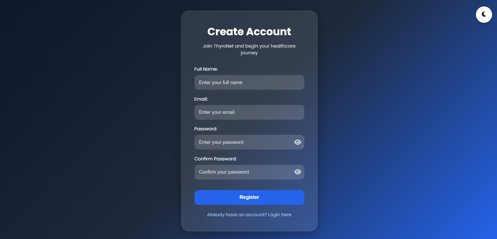
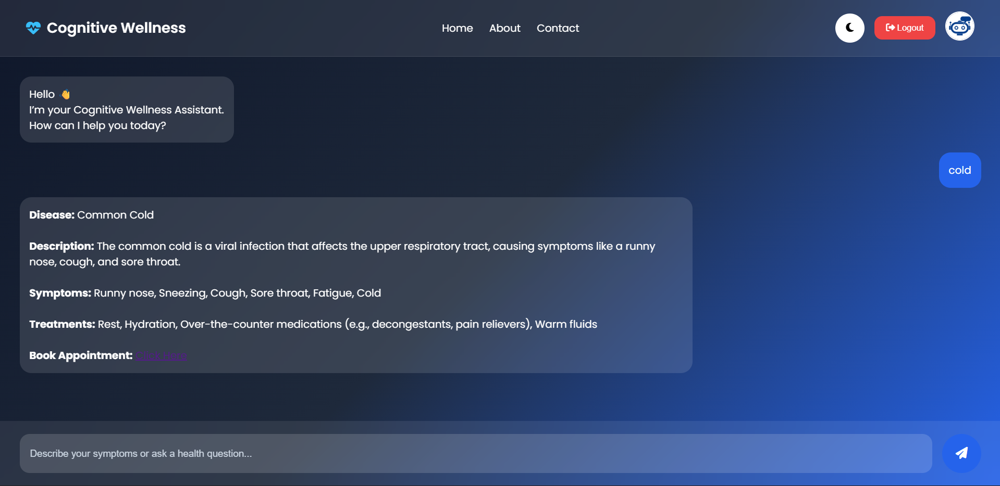
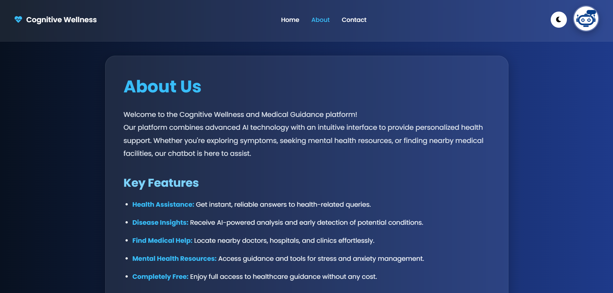
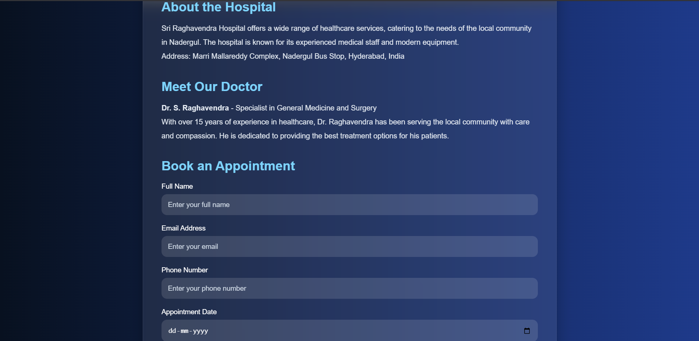

```md
## 🩺 Cognitive Wellness & Medical Guidance Chatbot

An AI-powered healthcare chatbot designed to provide real-time medical guidance, symptom analysis, disease prediction, and wellness support through an interactive and user-friendly interface.

---

# 📌 Overview

The **Cognitive Wellness & Medical Guidance Chatbot** helps users access essential healthcare guidance instantly without needing appointments or paid subscriptions.

Users can:
- Ask health-related questions
- Analyze symptoms
- Get possible disease predictions
- Explore treatment suggestions
- Access wellness guidance
- Book appointments
- Find nearby hospitals and doctors

The project combines modern web technologies with AI-based healthcare assistance to create an accessible and responsive healthcare support system.

---

# ✨ Features

## 🤖 AI Healthcare Assistance
Get real-time responses to healthcare-related questions and symptom analysis.

## 🩺 Disease Prediction
Analyze symptoms and identify possible health conditions using a healthcare dataset.

## 🌙 Dark / Light Mode
Modern responsive UI with theme switching support.

## 🔐 Authentication System
User registration, login, and logout functionality using MongoDB.

## 📅 Appointment Booking
Users can book appointments with hospitals and healthcare professionals.

## 🏥 Nearby Hospital Information
Quick access to hospital and doctor information.

## 🧠 Mental Wellness Guidance
Support and resources for stress, anxiety, and general wellness.

## 📱 Responsive Design
Works smoothly across desktop and mobile devices.

## 💬 Interactive Chat Interface
Typing animations, chatbot responses, auto-scroll, and modern chat bubbles.

---

# 🛠️ Tech Stack

## Frontend
- HTML5
- CSS3
- JavaScript

## Backend
- Node.js
- Express.js

## Database
- MongoDB Atlas

## Tools & Platforms
- VS Code
- GitHub
- Render

---

# ⚙️ Installation & Setup

## Clone Repository

```bash
git clone https://github.com/venkatrao7/Healthcare-Chatbot.git
cd Healthcare-Chatbot
```

---

## Install Dependencies

```bash
npm install
```

---

## Configure Environment Variables

Create a `.env` file in the root directory:

```env
MONGO_URI=your_mongodb_connection_string
```

---

## Run the Project

```bash
node server.js
```

or

```bash
npx nodemon server.js
```

---

# 🚀 Project Workflow

1. User logs into the platform
2. User interacts with chatbot
3. Chatbot analyzes symptoms/questions
4. Healthcare dataset is searched
5. Relevant response is generated
6. Appointment booking guidance is provided if required

---

# 🖥️ Screenshots
## Login Page



## Register Page



## Chatbot Interface



## About Page



## Appointment Booking


---

# 📂 Project Structure

```bash
Healthcare-Chatbot/
│
├── healthcare7/
│   ├── index.html
│   ├── about.html
│   ├── contact.html
│   ├── style.css
│   ├── script.js
│   └── dataset.json
│
├── form.html
├── register.html
├── server.js
├── package.json
├── .env
└── README.md
```

---

# 🔮 Future Enhancements

- AI Voice Assistant
- Multi-language Support
- Wearable Device Integration
- Advanced NLP-based Conversations
- Doctor Consultation Integration
- Chat History & User Profiles

---

# 👨‍💻 Team Members

- Neralla Shilpa
- Velagapudi Venkat Rao
- Taduri Lokesh
- Bangla Umesh Reddy

---

# 🤝 Contributing

Contributions are welcome.

1. Fork the repository
2. Create a feature branch
3. Commit your changes
4. Push to GitHub
5. Open a Pull Request

---

# 📄 License

This project is developed for educational and academic purposes.

---

# ⭐ Support

If you found this project useful, consider giving it a star ⭐ on GitHub.
